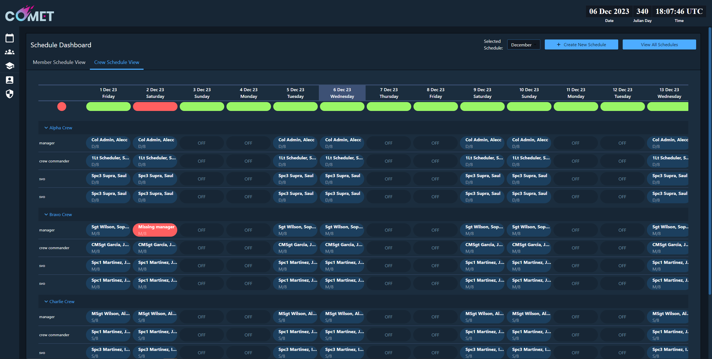

# Introduction
a crew scheduling tool I helped build for the USSF. It is meant to enable crew schedulers to do their job quickly and provide transparency and control to crew members so they can make schedule change requests and provide easy visibility for complete schedules with red/green indicators for shifts.

# Screenshot
* Note that all data shown in notional only for the staging environment, not real world data

# Hosting Platform
COMET is hosted on a platform as a service called PartyBus on Platform One, a DoD organization dedicated to hosting DoD software.

# Notable features I helped develop
- Red/Green indicators for schedule/shift adequately filled
- Redesign from legacy MVP to new UI with consistent color scheme and more thought through user flows
- Schedule creation wizard

# Tech Stack
- TypeScript/JavaScript
- NodeJS
- React
- Express
- MongoDB

# Tools Used
- Gitlab - version control and CI/CD pipeline management
- Visual Studio Code AKA VSCode
- Docker - containerizing for dev environment
- Sonarqube - code quality scanning

