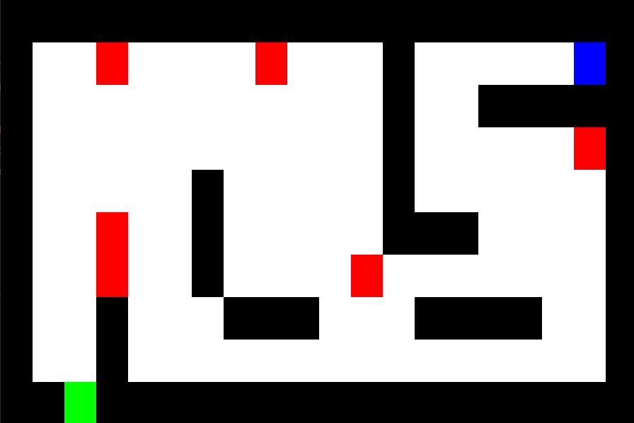

# Intro

The Dungeon Crawler barebones game was built by Boris Valerstein, the professor for the course that this project takes place in (SE 570 at Drexel University). I developed the features listed in the features section.

# Tech-Stack

- Java
- JUnit (TDD)
- Cucumber (BDD)
- Graphics.java
- Frame.java

# Features

- **Monsters** can be added to game levels using a `M` in the level file. They randomly move every 2 seconds. If a
  monster moves into a player, or a player moves into a monster, they lose the game.
- **Multiple Levels**. Exit tiles can be added to the game to advance a player to the next level (or win the game if
  it's the last level) using a `E` in the level file. Note: the game winning mechanics are dependent on changing
  the `maxLevels` variable in `GameState.java` to the correct max level. You can also adjust the starting level
  in this file by adjusting the `level` variable inital value.
- **10 prebuilt levels** are available to play and by default the game lets you play through all 10 levels before winning (
  see below for how to adjust this value). These levels can be changed or new levels can be built by placing new txt
  files in `src/main/resources/levels`. Note: You can only name the level files `[LevelNumber].txt` for them to
  be recognized

## Repo availability

I am unable to link the code repo publicly due to the code being part of a class, but if you'd like to see the repo, please send me a message on LinkedIn or an email at darius.despain@gmail.com if you'd like to see it.

## Adjustable parameters

- `maxLevels` in `src/main/java/engine/GameState.java`: adjusting this value will impact after which level the
  player wins the game
- `level` `src/main/java/engine/GameState.java`: adjusting the initial value here will impact the level the
  player starts on
- `INTERVAL_S` in `src/main/java/movement/AutoMoveMonsters.java`: adjusting this value will impact the frequency
  of monster movement, making it more or less difficult. The value represents the time interval between monster
  movements. As it is written, you cannot go below 1 movement per second, but this could be changed with a small code
  adjustment.

## Game Feedback

Feeback about winning or losing the game is printed to the console. See examples below.

```
----------------------------------------------------------------
----------------------------------------------------------------
Congratulations, you won!
You completed 10 out of 10 possible levels!
----------------------------------------------------------------
----------------------------------------------------------------
```

```
----------------------------------------------------------------
----------------------------------------------------------------
A Dungeon Monster got you, Game Over
You completed 1 out of 10 possible levels!
----------------------------------------------------------------
----------------------------------------------------------------
```

## Contributors

- Boris Valerstein
- Darius DeSpain
