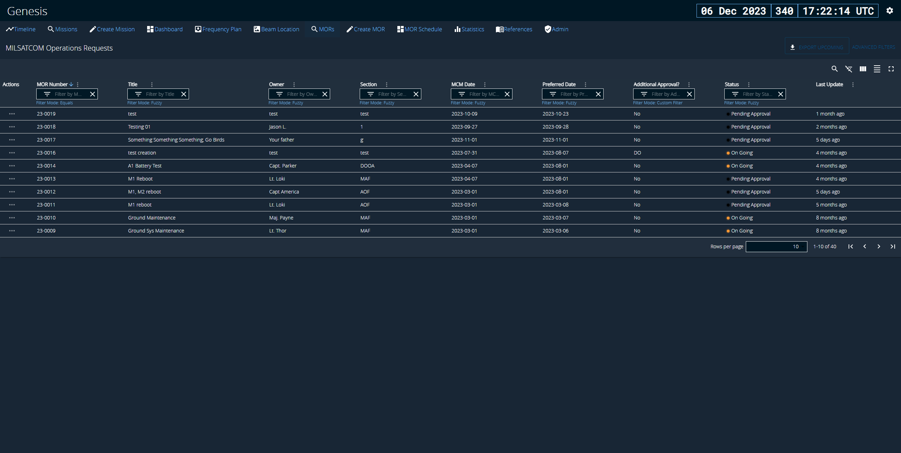

# Introduction
a tool I helped build for the 4th Space Operations Squadron (4 SOPS) under Space Delta 8 that digitized their internal maintenace requests called MILSATCOM Operations Requests (MORs) for coordination and helped visualize overlapping requests. The tool is now being used on the 4 SOPS operations floor.

# Screenshot
* Note that all data shown in notional only for the staging environment, not real world data

# Hosting Platform
The MOR Tool is hosted on another application called Genesis, which is a mission planning tool for the USSF. Genesis is hosted on a platform as a service called PartyBus on Platform One, a DoD organization dedicated to hosting DoD software.

# Notable features I helped develop
- Print to PDF from the digital form
- Rich text editor
- MOR Calendar with filters
- References page (updatable with excel file upload)
- Approval routing
- Customized role-based-access

# Tech Stack
- TypeScript/JavaScript
- NodeJS
- React
- Express
- CouchDB

# Tools Used
- Gitlab - version control and CI/CD pipeline management
- Visual Studio Code AKA VSCode
- Docker - containerizing for dev environment
- Sonarqube - code quality scanning

