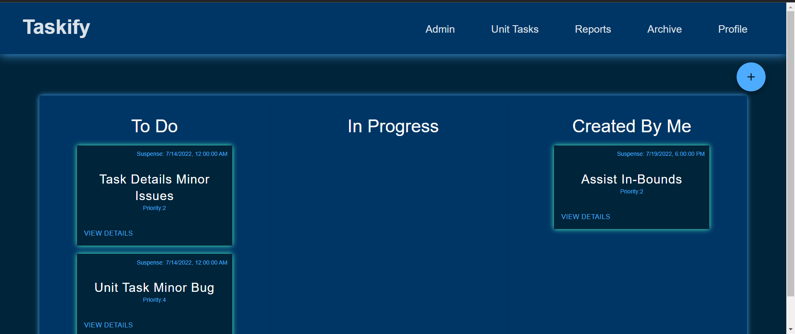

## Overview

Taskify is a dashboard-based task management tool which simplifies task tracking and streamlines Weekly Activity Reporting for units and individuals. Depending on their role(s), users can view, filter, create, update, delete, and assign tasks in a one-stop-shop. You can view the codebase at [our github page](#https://github.com/TheFreshTulips/capstone)

## Developers

- Nehemiah Alvarado [@Alvarado96](https://github.com/Alvarado96)
- Claire Badger [@Clairebadger](https://github.com/Clairebadger)
- Darius DeSpain [@darius-despain](https://github.com/darius-despain)
- Lauren Enders [@lenders-game](https://github.com/lenders-game)
- Isaac St. Pierre [@IsaacStPierre](https://github.com/IsaacStPierre)

## Table of Contents

1. [Overview](#overview)
1. [Description](#description)
1. [About our UI](#about-our-ui)
1. [About our Database](#about-our-database)
    1. [ERD](#erd)
1. [About our API](#about-our-api)
    1. [GET](#get)
    1. [POST](#post)
    1. [PATCH](#patch)
    1. [DELETE](#delete)

1. [Future Work](#future-work)
1. [Local Setup and Installation](#local-setup-and-installation)

## Description

Currently, military units rely heavily on email for tracking and dissemination of taskers within their organization. Since email is primarily used for broader communication, taskers are often overlooked and mismanaged as inboxes quickly become cluttered. By contrast, Taskify is a centralized location for task management where  members of a unit can create, update, complete, or collaborate on taskers. Users can have different roles and associated permissions.

Aside from task tracking, the second key feature of Taskify is weekly activity tracking. Weekly Activity Reports (WARs) are commonly used for oversight in military units, but the process of writing and reviewing them can be tedious and a time-sink. The same goes for writing awards packages and performance reports. Taskify streamlines that process by enabling supervisors to quickly see what their people are up to, and allowing servicemembers to easily refer back to their accomplishments when gathering bullets for EPRs/OPRs and awards.


## About Our UI

### Login & Registration
Upon visiting Taskify, a user views the Login page where they can enter their credentials. If they do not have an account, they can click a link which navigates to the Registration page. Once registered, a Taskify admin must add a role to the new user; either Member, Supervisor, or Admin.

#### Roles
- **Members** have basic permissions, they can...
    - View and create personal tasks.
    - View all tasks within their unit.
    - Complete tasks assigned to them. When a user completes a task, that task gets pushed to their Weekly Activity Reports page.

- **Supervisors** are akin to military supervisors, they can...
    - Create and assign tasks to members they supervise, as well as view all tasks within their unit and sub-unit.
    - View WARs for all members of their unit as well as their own WAR. They also retain all the permissions of a normal member.

- **Admins** are your mechanism for managing users and organizations, they can...
    - Modify and delete user permissions.
    - Create, modify, and delete organizations.

### Dashboard
After logging in, a user can see everything of immediate interest to them. Similar to a Kanban board, the Dashboard contains columns which house Task Cards. A user can create a Task Card to add to the To Do column.
- **To Do** contains tasks that are assigned to you and have a status of **To Do**, indicating that they haven't been started yet.
- **In Progress** contains tasks that are assigned to you and have a status of **In Progress**, indicating that they have been started, but are not completed yet.
- **Created By Me** contains tasks that are created by you, even if those tasks are not assigned to you or your organization.

    When a user clicks the [View Details](#task-details) button on a Task Card, they can see additional information and edit fields depending on their role.




### Header
The Header contains various navigation links: Unit Tasks, Reports, Archive, Profile, and Admin (if the user is an Admin). The Taskify link navigates back to the user's home Dashboard.

### Task Details
A Task Card displays additional details and allows task owners and supervisors to edit, delete, or update the task. There is also a comment section where any members of the unit can ask questions and provide helpful information.

### Unit Tasks
This page looks similar to Dashboard, except with just two columns: To Do, and In Progress. Regular members see all tasks in their unit while Supervisors can see tasks in subunits as well.

### Reports
This page contains weekly activity information for the unit displayed in a table. Tasks are only shown if they were completed this week or are currently in progress. A user can also toggle the table to only show their weekly activity.

### Archive
This page looks similar to Reports except it displays all tasks that the user has completed or helped complete.

### Profile
This page contains the user's profile information (name, rank, email, and organization) along with editable fields.

### Admin
This page is only visible to Admin users. It displays the admin menu with links to the View/Modify Roles page and View/Modify Organizations page. Each page contains a table with editable information relating to all users and organizations in Taskify.

## About our Database

Our database uses postgresql. Check out our Entity Relationship Diagram (ERD) below and our database configuration in  ./docker-compose.yml and ./api/knexfile.js.

### ERD


## About Our API
Taskify uses the following API endpoints:

### GET

#### /tasks/orgs/:id
- This endpoint serves an array of all tasks in a specified organization. Populates the [Unit Tasks](#unit-tasks) page.
- Returns: an array of objects representing each task

        {
            task_id,
            task_title,
            task_status,
            task_description,
            task_priority,
            task_suspense_date,
            task_completed_date,
            author_rank,
            author_name,
            task_org_id,
            task_org_name,
            owners: [
                {
                    owner_rank
                    owner_name
                },
                ...
            ]
        }

- Error code(s):
    - 404: if **:id** is not provided

#### /tasks/users/:id
- This endpoint serves an array of all tasks held by a specified user id; Populates the [Dashboard](#dashboard) page.
- Returns: an array of objects representing each task
        {
            task_id,
            task_title,
            task_status,
            task_description,
            task_priority,
            task_suspense_date,
            task_completed_date,
            author_id,
            owners: [
                {
                    owner_rank
                    owner_name
                },
                ...
            ]
        }

- Error code(s):
    - 404: if **:id** is not provided

#### /tasks/:id
- This endpoint serves detailed information for a given task id. Populates the [Task Details](#task-details) page.
- Returns: an array of objects representing each task

        {
            task_id,
            task_title,
            task_description,
            task_status,
            task_priority,
            task_assigned_date,
            task_suspense_date,
            task_completed_date,
            author_id,
            author_rank,
            author_name,
            comments: [
                {
                    comment_id,
                    comment_body,
                    user_rank,
                    user_name,
                    comment_timestamp
                },
                ...
            ],
            owners: [
                {
                    owner_rank
                    owner_name
                },
                ...
            ]
        }

- Error code(s):
    - 404: if **:id** is not provided

#### /tasks/users/:id/created
- This endpoint serves tasks that a given user has created. Helps to populate the [Dashboard](#dashboard) page.
- Returns: an array of objects representing each task

        {
            task_id,
            task_title,
            task_status,
            task_priority,
            task_suspense_date,
            author_id
        }

- Error code(s):
    - 404: if **:id** is not provided

#### /war/orgs/:id
- This endpoint serves an array of all tasks with a specified org id that have been assigned or completed in the past week. Populates the [Reports](#reports) page.
- Returns: an array of objects representing each task

        {
            task_id,
            task_title,
            task_description,
            task_completed_date,
            task_status,
            task_org_name
            owners: [
                {
                    owner_rank
                    owner_name
                },
                ...
            ]
        }

- Error code(s):
    - 404: if **:id** is not provided

#### /war/users/:id
- This endpoint serves an array of all tasks with specified user id that have been assigned or completed in the past week. Populates the [Reports](#reports) page.
- Returns: an array of objects representing each task

        {
            task_id,
            task_title,
            task_description,
            task_completed_date,
            task_status,
            task_org_name,
            owners: [
                {
                    owner_rank
                    owner_name
                },
                ...
            ]
        }

- Error code(s):
    - 404: if **:id** is not provided

#### /users/:id
- This endpoint serves the profile details of a specific member
- Returns: an array of 1 object representing the user with the specified id

        {
            user_id,
            user_name,
            user_rank,
            org_id,
            org_name,
            user_email,
            position_id,
            position_name
        }

- Error code(s):
    - 404: if **:id** is not provided

#### /users
- This point serves an array of all users. Populates the [View/Modify Roles](#admin) admin page.
- Returns: an array of objects representing each user

        {
            user_id,
            user_name,
            user_rank,
            org_id,
            org_name,
            user_email,
            position_id,
            position_name
        }

#### /users/orgs/:id
- This endpoint serves an array of users for a given organization. It only gets users for the specific organization, not child organizations.
- Returns: an array of objects representing each user

        {
            user_id,
            user_name,
            user_rank,
            org_id,
            org_name,
            user_email,
            position_id,
            position_name
        }


- Error code(s):
    - 404: if **:id** is not provided

#### /orgs
- This endpoint serves an array of all organizations. Populates the [View/Modify Organizations](#admin) admin page.
- Returns: an array of objects representing each organization

        {
            org_id,
            org_img_url,
            org.name as org_name,
            org_parent_id,
            parent_name
        }

#### /orgs/:id
- This endpoint serves details for an organization with the given id.
- Returns: an array of 1 object representing the specified organization

        {
            org_id,
            org_img_url,
            org_name,
            org_parent_id,
            parent_name
        }

- Error code(s):
    - 404: if **:id** is not provided

#### /orgs/:id/children
- This endpoint serves an array of children orgs for the given id. Helps populate any page with a supervisor view.
- Returns: an array of objects representing each child organization

        {
            org_id,
            org_name
        }

- Error code(s):
    - 404: if **:id** is not provided

### POST
#### /tasks
- This endpoint posts a new task created by a user
- Expects the following body:

        {
            title (string, max 250 chars),
            description(string, max 1000 chars),
            priority (integer),
            suspense date (timestamp using JS Date() format),
            comments (null),
            status (string, max 250 chars),
            owners: [
                ownerId,
                owner2Id (optional),
                ...
            ],
            creator_id (integer),
            org_id (integer)
        }

- Error code(s):
    - 404: (Error message is given in the response body)
        - if all expected fields are not provided
        - if the organization id provided is not valid
        - if the author is not valid

#### /tasks/:id/comments
- This endpoints creates a new comment for a task
- Expects the following body:

        {
            body (string, max 1000 chars),
            task_id (integer),
            user_id (integer)
        }

- Error code(s):
    - 404:
        - if task_id is not valid
        - if there was an error adding the comment to the task

#### /login
- This endpoint serves success or failure depending on if the email and password are correct in the body. Used for the [Login](#login--registration) page.
- Expects the following body:

        {
            email (string, max 250 chars),
            password (string, max 250 chars)
        }

- Error code(s):
    - 404:
        - if user not found
        - if one of the fields was not valid
    - 400:
        - if the user cannot be logged in (usually incorrect password)

#### /register
- This endpoint posts a new user from the registration page as a member.Used for the [registration](#login--registration) page.
- Expects the following body:

        {
            name (string, max 250 chars),
            rank (string, max 250 chars),
            email (string, max 250 chars),
            position_id (integer),
            password (string, max 250 chars),
            org_id (integer)
        }

- Error code(s):
    - 400:
        - if the email provided is already taken
    - 404:
        - if all expected fields are not provided

#### /orgs
- This endpoint posts a new organization (for admins)
- Expects the following body:
        {
            img_url,
            name,
            parent_id
        }

- Error code(s):
    - 404:
        -  if the parent org is invalid

#### /owners/:id
- This endpoint should be called when an owner is being added to a task with the specified id.
- Expects the following body:

        {
            owners: {
                user_id (integer),
                task_id (integer)
            }
        }

- Error code(s):
    - 404: if **:id** is not provided
    - 400: if the owners field is not provided

### PATCH

#### /tasks/:id
- This request edits a task
- Expected body:

        {
            title,
            description,
            priority,
            suspense date,
            status
        }

- Error code(s):
    - 404:
        - if task edit is unsuccessful
        - if all expected fields are not provided

#### /users/:id
- This request edits a user. Supports the Profile and [View/Modify Roles](#admin) pages.
- Expected body:

        {
            name (string, max 250 chars),
            rank (string, max 250 chars),
            org_id (integer),
            email (string, max 250 chars),
            position_id (integer),
            password (string, max 250 chars)
        }

- Error code(s):
    -  404:
        - if all expected fields are not provided
        - if **:id** is not provided

#### /orgs/:id
- This edits an org. Supports the [View/Modify Organizations](#admin) admin page
- Expected body:

        {
            name (string, max 250 chars),
            img_url (string, max 250 chars),
            parent_id (integer)
        }

- Error code(s):
    -  404:
        - if all expected fields are not provided
        - if the parent org is invalid

### DELETE
/tasks/:id
- This request deletes a task by task id
- Responds with status 200 and "Number of records deleted: **x**"
- Error code(s):
    - 404:
        - if **:id** is not provided
        - if the deletion fails

#### /users/:id
- This request deletes a user by user id
- Responds with status 200 and "Number of records deleted: **x**"
- Error code(s):
    - 404:
        - if **:id** is not provided
        - if the deletion fails

#### /orgs/:id
- This request deletes an organization by org id
- Responds with status 200 and "Number of records deleted: **x**"
- Error code(s):
    - 404:
        - if **:id** is not provided
        - if the deletion fails


#### /owners/:id/
- This request deletes an entry matching an owner to a task id
- Responds with status 200 and "Number of records deleted: **x**"
- Error code(s):
    - 404:
        - if **:id** is not provided
        - if the deletion fails

## Future Work

There are number of additional features that could be added to future versions of Taskify:

- Displaying stats about members workload to supervisors so they can determine if a member is over or under tasked
- Displaying tasks to a supervisor that are assigned to a specific member so they can re-allocate workload as necessary
- Drag and drop task cards
- Exportable reports
- Clickable inputs in Reports tables which allow users to view task details
- Saving user login sessions for longer-term use


## Local Setup and Installation

### Docker-Compose:

- Fork and clone with github [repo](https://github.com/TheFreshTulips/capstone)

    git clone <url>


install dependencies for the api and ui prior to docker-compose (must be in the ui and api directories)

    npm install

install docker and docker-compose on your desktop if you havent already.
- Visit https://docs.docker.com/get-docker/ for more information

check docker is running in the command line

    docker -v

build app using docker-compose (must be in root directory of this repo)

    docker-compose up

You can now view the application at the following URLs

 - UI: localhost:3000

 - API: localhost:8080

When you're done, you can bring down the application with `CTRL+C` or if you ran `docker-compose up` with a `-d` flag then run another docker-compose command to stop

    docker-compose down


### Setup Troubleshooting:

- If you get the message, ```PostgreSQL Database directory appears to contain a database; Skipping initialization```, followed by the error, ``` FATAL:  database "[db name]" does not exist```, then you likely changed the name of the database, which is fine, but you need to re-initialize the database now to make the new name take effect.

  - remove the volume from docker, this will trigger re-initialization. The first way uses compose down and will destroy the volume after it is finished.

        docker-compose down --volumes

  - another method for removing the volume manually

        docker volume ls
        docker volume rm [volumeName]

### Dependencies:

UI:

- React
- react-router-dom

API:

- Express
- Knex
- Bcrypt (for authentication)
- CORS
- pg
- Nodemon

Database:

- PostgreSQL