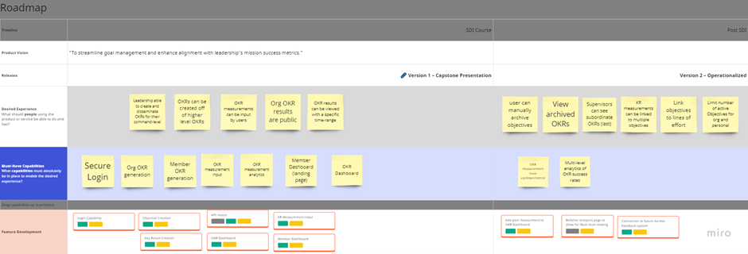
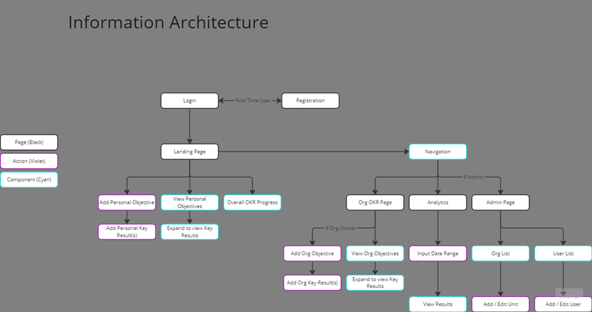
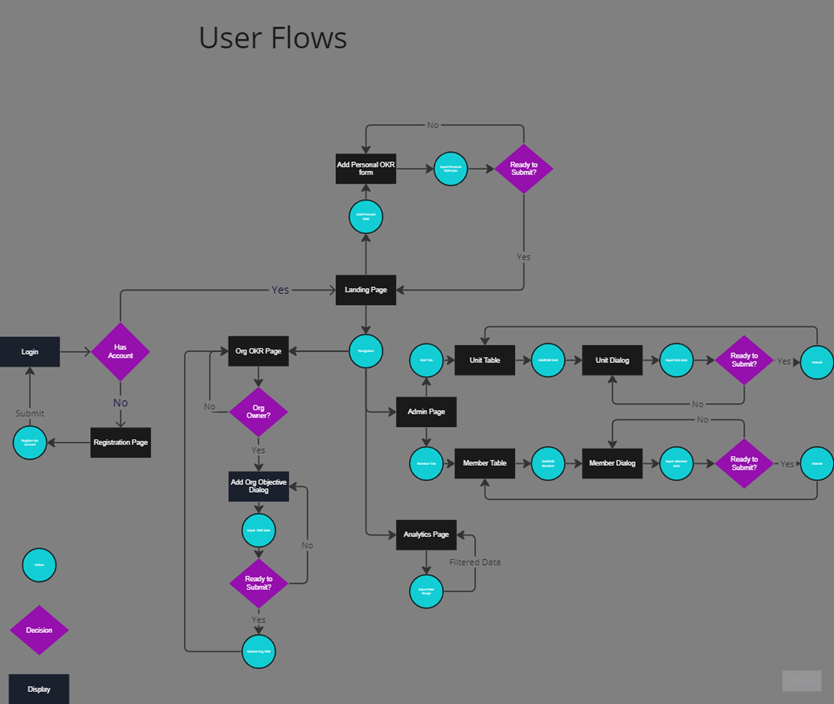

# Introduction
Our team got this problem area from an office in USSF/STARCOM/ETMO. They were looking for a tool to track, communicate, and visualize Objectives and Key Results (OKRs). We took their problem area and expanded upon some ideas to make a full-stack application for it. You can find the code repository at the github page [here](https://github.com/SDI-20-Capstone/ThugNasty-Capstone).

## Work-breakdown
This app was created by software development students in Galvanize's Software Development Immersive #20. I served as the product manager on this team for the capstone of my Agile Software Product Management bootcamp also by Galvanize. We had 5 software developer students and 3 other product management students on this team.

# Product Info
## Problem Statement
The current process of creating, sharing, and measuring objectives and key results from leadership is completely manual and selective in use. This drives difficulty in providing feedback to Guardians on meeting objectives and leadership's mission success metrics.

## Product Vision
To streamline goal management and enhance alignment with leadership's mission success metrics.

## Product Roadmap
I, along with my teammates, created this roadmap with all the desired features and user experiences we thought could be in the app.

## Information Architecture

## User Flows

## UI Mockup
Our PM team created [a mockup](https://www.figma.com/file/ORC6pSrKwXVLJz12i79uv2/SDI-20-Capstone?type=design&node-id=0-1&mode=design) of the designs that the developers implemented.