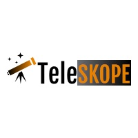
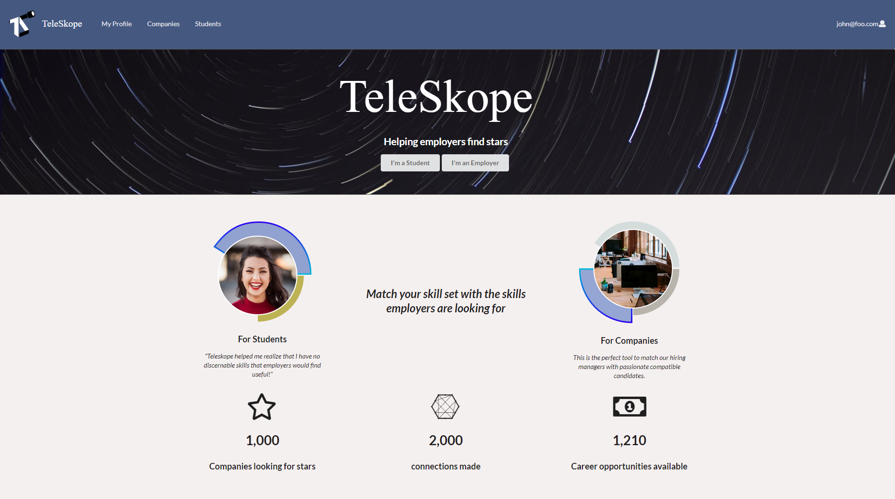

For my Computer Science 314 class, Software Engineering, we had the task of creating a final project to tie together all the skills we had learned over the course of the semester. We spent the first half of the semester learning the basics, starting with Javascript, then moving on to HTML, CSS, and finally meteor and react to build more complicated web pages. I worked together on this final project with Jeff Takiguchi, Josh Walters, and Matthew Kim.

## Prompt- Company Connector  
### Problem
The idea that our project was based around was assigned to us by our professor. The company connector idea was proposed to solve the problem of UH computer science and engineering students not being able to find out about job and internship opportunities until the company comes to campus or sends an announcement. 

### Solution
The solution to this problem is to create a web application for local and non-local companies to recruit students from UH and make opportunities known to students as well as give students a place to see what's available and showcase themselves to companies.

A more detailed description of this prompt can be found on our [course website](http://courses.ics.hawaii.edu/ics314s19/morea/final-project/reading-project-company-connector.html) 

## Final Product

Our group took this prompt and came up with our own interpretation of the solution by deciding we wanted to have a central place for students and companies to browse for companies, but also include some personalization. We did this through allowing profiles to be made for both companies and students. These profiles allow you to link your social media, email, and other websites, write a bio about yourself, and most importantly add skills to your profile to help better match you with companies. Once you create your profile and add skills, then the companies page will display not only all companies, but companies at the top that match your skills closely. You can also favorite companies you are interested in to add them to your following list. Companies can also show interest in a particular student through the same favoriting system. These notifications of companies you are following and companies that are interested in you are all shown in the dashboard page.

## Expandability

If we went further with the project, we envisioned the following features being added to improve user functionality.

- Admin user management functionality
- Search bar
- Adding companies directly from the company user interface
- Adding jobs directly from the company user interface
- being able to edit social media links through the edit user interface

These issues were ones that we realized we did not have time for and as we have free time we may update the project with them as we figure them out.

## See us on Github!
You can see our code and more project information at our [Github Project Page](https://teleskope.github.io/)

